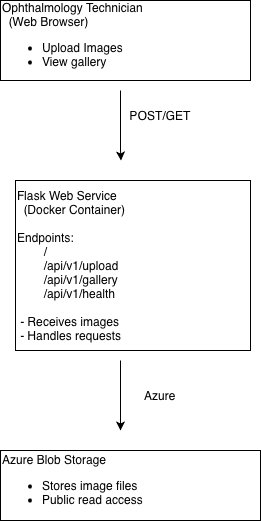

# Ophthalmic-Imaging-Service-Final

## 1) Executive Summary

**Problem:**  
Ophthalmology offices frequently store data in the form of images and scans. These images need to be securely stored and reviewed by physicians for each patient. In many clinics, this process is fragmented, leading to inefficiencies and room for inaccurate processing.  

**Solution:**  
This project solves these inefficiencies by implementing containerized web service that allows ophthalmology technicians to upload ophthalmic images and scans through a browser and review them in a unified gallery. The uploaded images are stored in Azure Blob Storage, and the application is fully containerized using Docker for reproducibility.

## 2) System Overview

**Course Concepts:**  
The course concepts that were used in this project include Flask for web API, Azure Blob Storage for image storage, and Docker for containerization and reproducibility.

**Architecture Diagram:**
An architecture diagram is included in /assets and embedded in the repository. 


**Data/Models/Services:**
The application handles ophthalmic image files that are uploaded using a web interface and stored in Azure Blob Storage. 

## 3) How to Run (Local)

```bash
# build the container image
docker build -t ophthalmic-image-service .

# run the container
docker run --rm -p 8080:8080 --env-file .env ophthalmic-image-service

# health check
curl http://localhost:8080/api/v1/health
```
## 4) Design Decisions
**Why this concept?**
Flask provides a framework for minimal web API service. Azure Blob Storage also provides efficient storage for large image files. Docker enables consistent deployment across machines and environments. Furthermore, these concepts and tools were covered in lecture and assignments. 

**Tradeoffs:**
There are a few tradeoffs for a minimal demo. One is that there are no user authentication and the images that are uploaded are not validated beyond the upload. Furthermore, the public read access needs further editing. In general, security and access reliability are the primary limitations. 

**Security/Privacy:**
There are no secrets that are committed to the repository and credentials are in environment variables. As this is a medical database, there is no patient identifying information that is collected or stored, and uploaded images are used for demonstration.

**Ops:**
A health check endpoint is included to indicate service availability. Containerization ensures consistent runtime and testing. 

## 5) Results and Evaluation
Through the web form, users can upload ophthalmic images, which appear immediately in the gallery. The health endpoint indicates that the service is available and running correctly. Testing was performed by uploading images through the browser and verified through the gallery. 

## 6) What’s Next
Future improvements would focus on security. Adding authentication and access control would restrict upload to authorized users. Furthermore, restriction on file type and size would ensure efficient and safe storage. The system could also associate each image with patient  information/history and past scans for more efficient clinical databases.  

## 7) Link

GitHub Repo: https://github.com/seb154/Ophthalmic-Imaging-Service-Final


